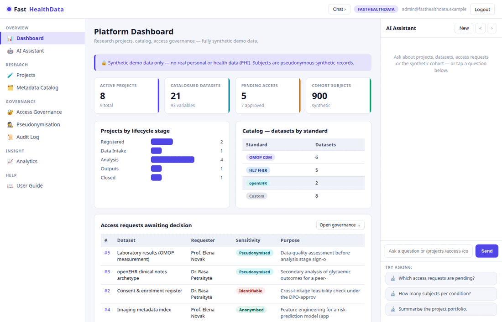
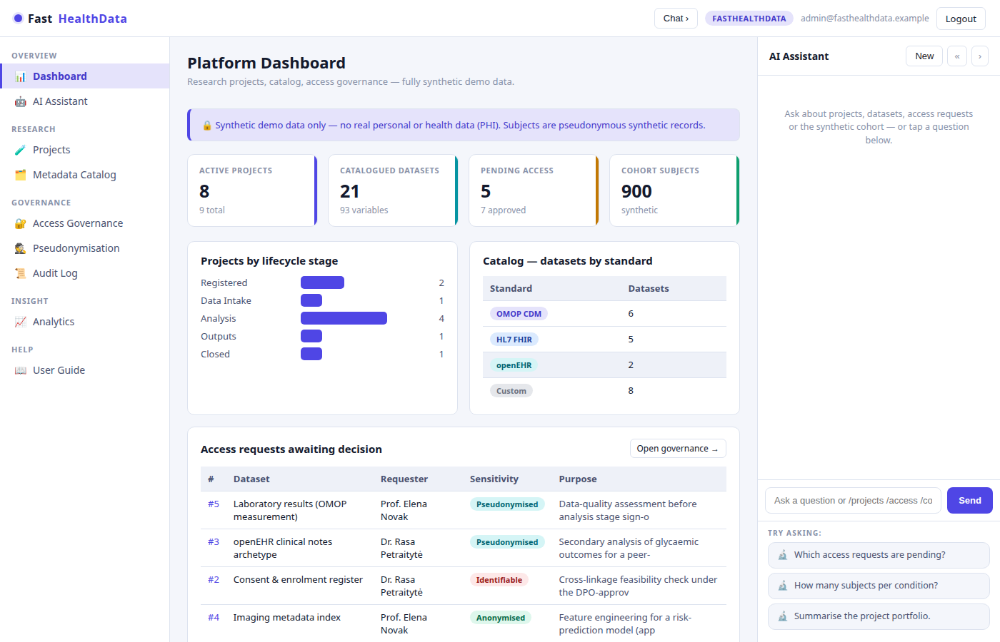
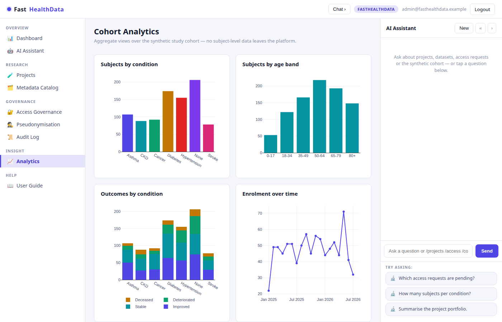
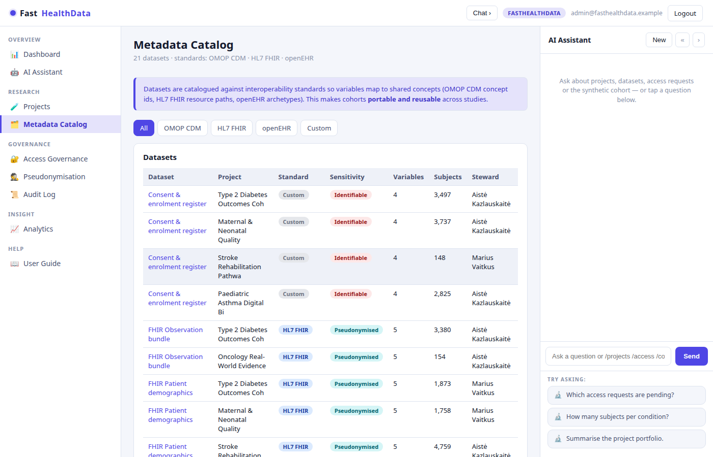
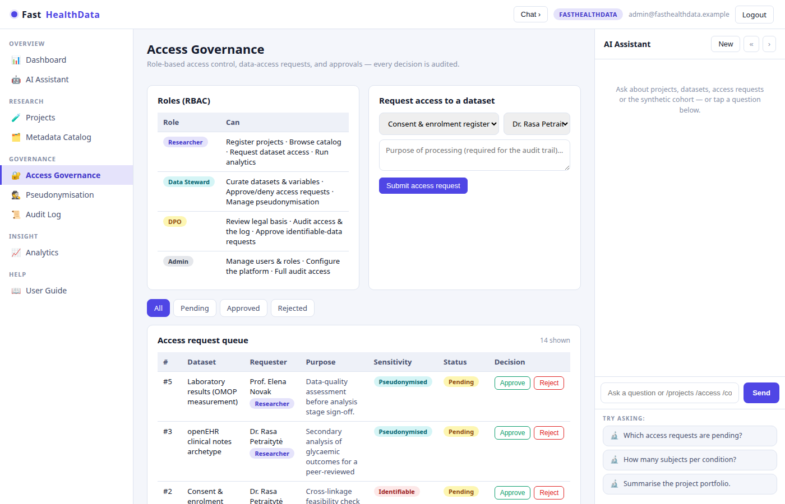

# FastHealthData

**FastHealthData** is an open-source **health research-data platform** built with
[FastHTML](https://fastht.ml) — a server-side, HTMX-driven app that manages health
research projects and their data across the whole lifecycle, with a **built-in AI
assistant** grounded in the platform's own data. Python-first, no JavaScript
framework, SQLite, MIT-licensed.

*Research data you can govern.* Runs on port **5013**.



<p align="center">
  
  
</p>
<p align="center">
  
  
</p>

> **Synthetic data only — no PHI.** Everything ships and runs on deterministic,
> fully synthetic data generated by `seed.py`. There is no real personal or
> health data anywhere in this repository; "subjects" are pseudonymous synthetic
> records that exist purely to make the analytics view live.

FastHealthData is part of the **FastGov** suite of open-source, standards-aware
building blocks for public-sector and research digitisation (alongside FastCRM,
FastHelpdesk, FastInsights, FastClinic …). It is also the reference
implementation behind Predictive Labs' bid for the Lithuanian **SDMA IS** health
data scientific-analytics tender.

## What it does

A minimal but runnable skeleton of the core capabilities a health data platform needs:

- **Research project lifecycle** — register a project and move it through
  *Registered → Data Intake → Analysis → Outputs → Closed*, with legal basis
  (GDPR Art. 6/9) and ethics reference on every project.
- **Metadata catalog** — datasets and their variables, each tagged with the
  interoperability standard it follows: **OMOP CDM**, **HL7 FHIR**, **openEHR** or
  custom. Variables carry concept codes and PII flags so cohorts stay portable.
- **Access governance** — **RBAC** roles (Researcher / Data Steward / DPO / Admin),
  data-access requests with a stated purpose, approve/deny decisions, and an
  append-only **audit log**.
- **Pseudonymisation** — a demo stub that turns a direct identifier into a stable,
  one-way pseudonym, plus a live **k-anonymity** measure over the cohort.
- **Analytics** — Plotly charts over the synthetic cohort (by condition, age band,
  outcome, enrolment). Aggregates only — no subject-level data leaves the platform.
- **AI assistant** — a right-rail chat that answers over a live snapshot of the
  platform (text-to-insight). Slash-commands work with **no API key**.
- **Typed integration API** — OpenAPI-described projects, catalog registration,
  governed access decisions, audit evidence, aggregate cohort analytics,
  pseudonymisation, and k-anonymity workflow contracts.

## Quickstart (native)

```bash
python -m venv .venv
.venv/bin/python -m pip install -r requirements.txt
cp .env.sample .env          # optional — add an LLM key for free-form AI chat
.venv/bin/python web_app.py  # http://localhost:5013  (self-seeds on first boot)
```

Login: `admin@fasthealthdata.example` / `FastHealthData2026$` (override in `.env`).
Rebuild demo data any time: `.venv/bin/python seed.py`.

## Run with Docker

```bash
docker compose up --build      # http://localhost:5013
```

`Dockerfile` (python:3.12-slim, port 5013) seeds on first boot;
`docker-compose.yml` mounts a `fasthealthdata-data` volume at `/data` so the
SQLite DB survives rebuilds.

## Module tour

- **Dashboard** (`/`) — portfolio KPIs, projects by stage, datasets by standard,
  and the pending-access worklist.
- **Projects** (`/projects`) — register projects; open one to walk the lifecycle
  and see its datasets, legal basis and ethics reference.
- **Metadata Catalog** (`/catalog`) — datasets by standard; open a dataset for its
  variables, concept codes, and PII flags.
- **Access Governance** (`/access`) — RBAC matrix, request access to a dataset,
  approve/deny (each decision hits the audit log).
- **Pseudonymisation** (`/pseudonymise`) — pseudonymise an identifier; read the
  live k-anonymity risk over the cohort.
- **Analytics** (`/analytics`) — cohort charts.
- **Audit Log** (`/audit`) — append-only record of governance actions.
- **AI Assistant** (right rail) — chat over a live snapshot. Slash-commands
  (`/projects`, `/catalog`, `/access`, `/cohort`, `/kanon`, `/kpi`, `/help`)
  resolve instantly with **no API key**.

## Standards & governance notes

- **OMOP CDM / HL7 FHIR / openEHR** are modelled at the catalog level — datasets
  declare which standard their variables map to, so the same cohort concept is
  reusable across studies. This is a *metadata* demonstration, not a full ETL.
- **Pseudonymisation is a stub.** It shows the concept — identifiers never enter
  the research zone in the clear — using a salted SHA-256 digest. A production
  deployment uses a keyed HMAC inside an HSM/KMS and holds the re-identification
  table under separate access control (GDPR Art. 4(5)).
- **k-anonymity** is computed over the synthetic cohort's quasi-identifiers as a
  release-readiness signal, not a formal disclosure-control guarantee.

## Configuration

`.env` (see `.env.sample`). Free-form AI chat needs one provider:

```ini
MODEL_PROVIDER=xai          # xai | openai | anthropic | google
MODEL_NAME=grok-4-1-fast-reasoning
XAI_API_KEY=...
```

Without a key the whole app still works and slash-commands answer from SQLite.

## Integration API

The FastAPI integration surface is mounted at `/api`, with human documentation
at `/developers`, Swagger UI at `/api/docs`, ReDoc at `/api/redoc`, and the
runtime schema at `/api/openapi.json`. A stable generated snapshot is committed
as `swagger.json`.

Public routes expose only synthetic project/catalog metadata and aggregate
cohort analytics. Set `FASTHEALTHDATA_API_TOKEN` (or the fleet-compatible
`FASTSME_API_TOKEN`) to enable project and dataset registration, lifecycle
changes, catalog-variable curation, users, access requests and decisions, audit
evidence, pseudonymisation, and k-anonymity signals:

```bash
curl https://healthdata.fastsme.com/api/v1/summary
curl -H "Authorization: Bearer $FASTHEALTHDATA_API_TOKEN" \
  https://healthdata.fastsme.com/api/v1/access-requests
```

The catalog API accepts metadata and mappings, not raw subject-level rows. The
pseudonymisation and k-anonymity endpoints are explicit demo workflow contracts;
they are not production disclosure-control guarantees.

## Architecture

```
web_app.py        routes, auth, SSE chat endpoint, boot
db.py             SQLite schema + vocabularies + pseudonymisation + k-anonymity + reads
seed.py           deterministic synthetic-data generator (no PHI)
web/layout.py     3-pane shell, CSS, chat JS
web/views.py      page renderers
web/ai.py         slash-commands + multi-provider streaming chat
web/charts.py     Plotly chart specs (client-side render, no server plotting dep)
web/api.py        typed integration API + token-gated governance operations
web/developer.py  public API entry point
```

See **[SKILLS.md](SKILLS.md)** for the capability reference.

## Licence

MIT © 2026 Predictive Labs Ltd. Part of the **FastGov** open-source suite.
